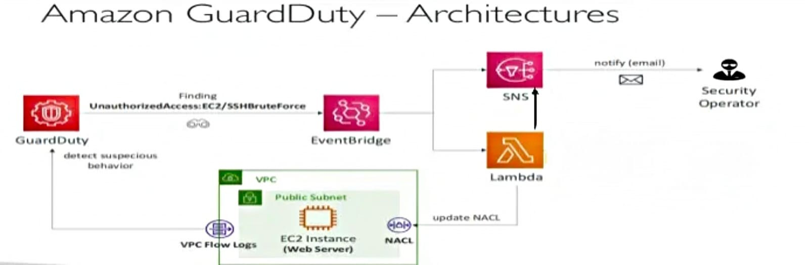
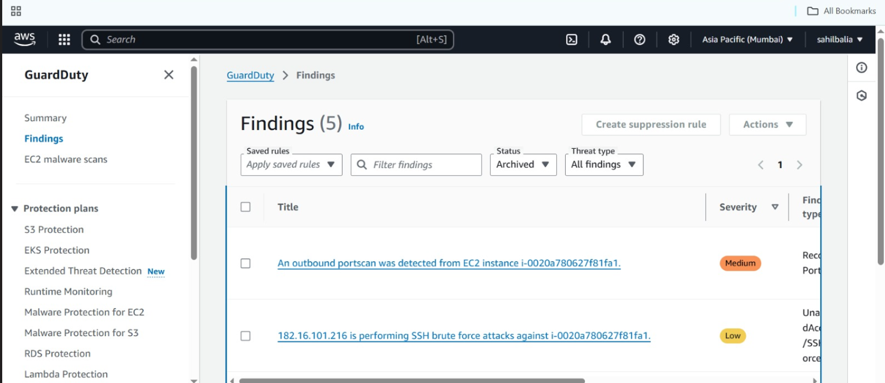
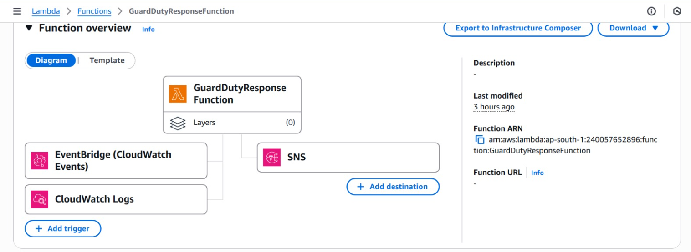
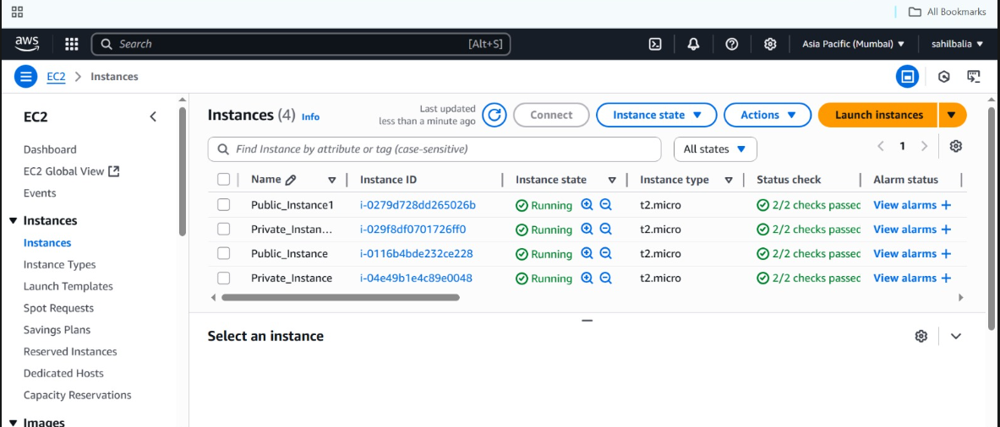
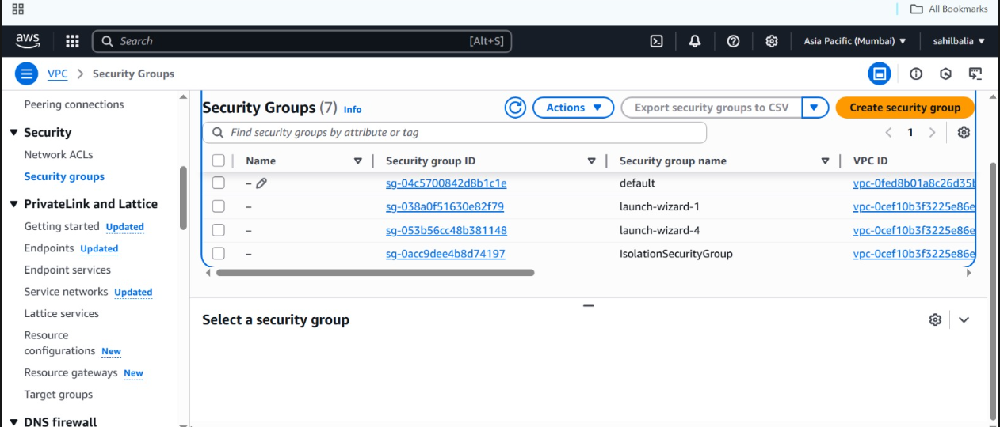

# 🛡️ Automated Threat Detection & Response 

This simulates real-world cloud security incidents and demonstrates automated threat detection and response using AWS-native services. Infrastructure is provisioned with Terraform and integrates GuardDuty, AWS Config, Security Hub, CloudTrail, and Lambda.

> ⚙️ Designed as a portfolio project to showcase hands-on cloud security and DevSecOps engineering skills.

---

## 🚀 Key Features

- **AWS GuardDuty** detects port scans and other suspicious behavior
- **AWS Lambda** automatically isolates compromised EC2 instances
- **AWS Config** enforces compliance with encryption and network hardening rules
- **MITRE ATT&CK-aligned threat simulation**

---

## 🧰 Tech Stack

| Tool            | Purpose                         |
|-----------------|----------------------------------|      
| AWS EC2         | Target + attacker VMs            |
| AWS GuardDuty   | Threat detection                 |
| AWS Lambda      | Automated incident response      |
| AWS Config      | Compliance monitoring            |
| Python (Boto3)  | Lambda scripting                 |
| EventBridge     | Event-driven automation          |

---

## 🗺️ Architecture

> *This diagram shows the flow from threat detection → Lambda response → EC2 isolation.*

---
## Project Configuration Overview
This project includes setup and configuration for key AWS services to build a secure, scalable, and event-driven architecture.

1️⃣ VPC (Virtual Private Cloud)

Creates a logically isolated network in AWS with subnets, route tables, and internet gateways to host resources securely.

2️⃣ EC2 (Elastic Compute Cloud)

Launches virtual servers to run applications, with customizable instance types, security groups, and key pairs.

3️⃣ SNS (Simple Notification Service)

Sets up a messaging service to send alerts or notifications via email, SMS, or other endpoints.

4️⃣ GuardDuty

Enables intelligent threat detection to monitor AWS accounts and workloads for malicious activity and unauthorized behavior.

5️⃣ Lambda

Configures serverless functions that run code in response to events, such as SNS messages or CloudWatch alarms.

6️⃣ IAM (Identity and Access Management)

Defines roles, policies, and permissions to securely control access to AWS resources.

7️⃣ CloudWatch

Monitors logs, metrics, and events from AWS services to enable observability and automated responses.

## 📸 Screenshots

### 🔍 GuardDuty Finding – Port Scan Detection
GuardDuty identifies reconnaissance activity (`Recon:EC2/Portscan`) triggered by an Nmap scan.

---

### 🚨 Lambda Function Overview
Lambda function Overview shown the Overview.

---

### 🔒 EC2 Instance
An Amazon EC2 (Elastic Compute Cloud) instance is a virtual server in the AWS cloud. It provides scalable computing capacity, allowing you to run applications just like you would on a physical machine—but with the flexibility and power of the cloud.
You have full control over your instance from launch to termination, including OS selection, configuration, and software installation.

---

### 🧩 Security Group
A security group in Amazon VPC acts as a virtual firewall that controls inbound and outbound traffic to and from AWS resources like EC2 instances.

---
## 🎯 Skills Demonstrated

* Cloud Security Engineering (GuardDuty, Config, IAM, Security Hub)
* DevSecOps Automation with Lambda + SNS
* Incident Response (detection → action flow)
* AWS Governance & Compliance (CIS, NIST)
* Real-world threat simulation with MITRE ATT\&CK mapping

---

## 👋 Author

**RUSHIKESH KADAM**
🔗 [LinkedIn](https://www.linkedin.com/in/rushikeshkadam894/)

---
